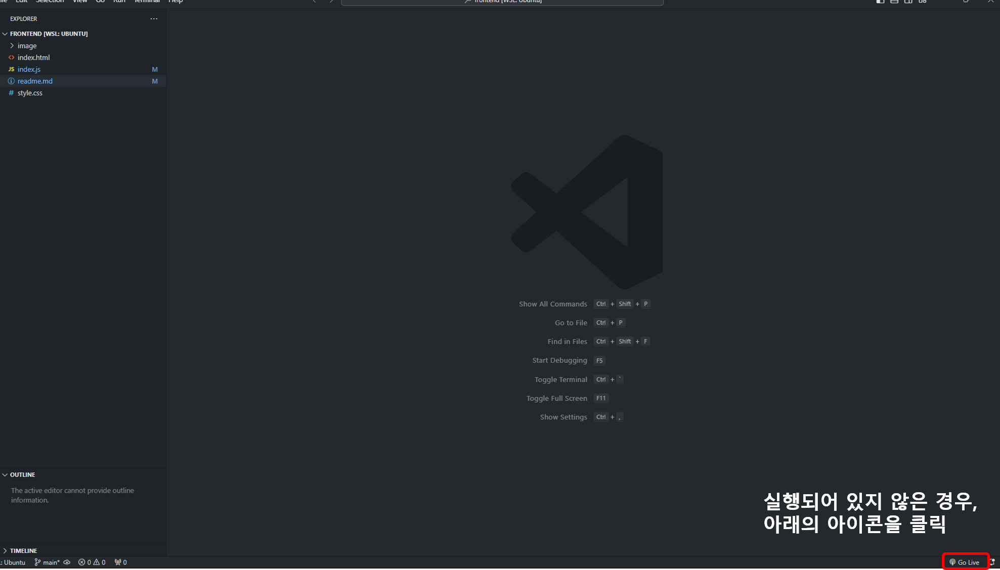
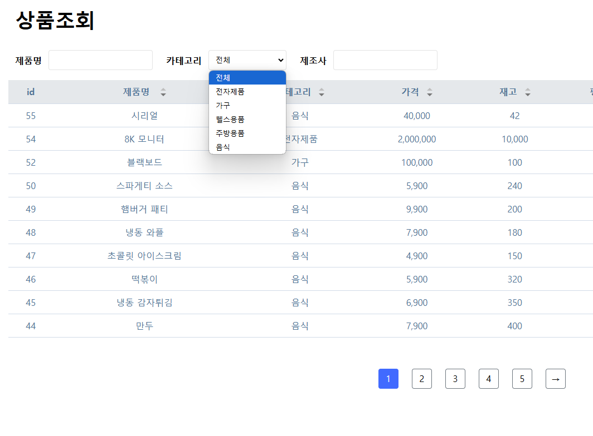
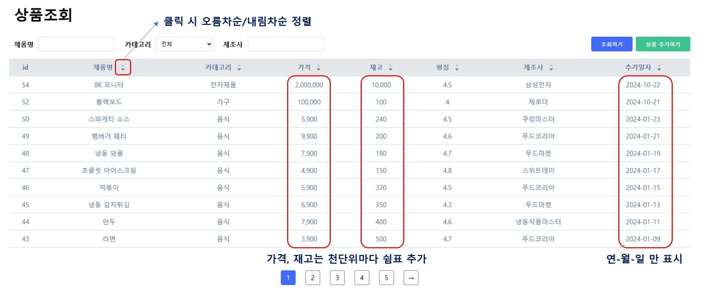
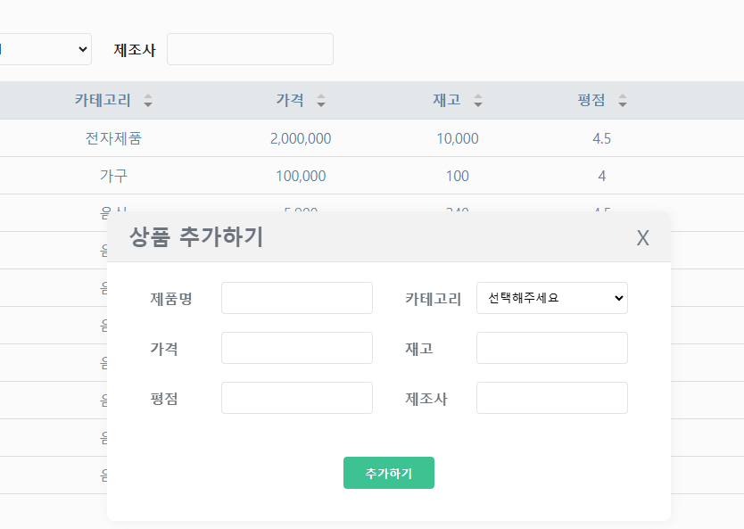

## 상품조회 화면 구현하기

### 구현 및 테스트 방법
- (vscode) 우측 하단에 있는 'Go Live' 버튼을 클릭하여 live server를 실행하면, http://localhost:5500 으로 접속하여 테스트할 수 있습니다. 

- 아래의 요구사항을 구현하기 위해, 제공된 파일 (index.html, style.css, index.js)의 내용을 추가 또는 수정하시면 됩니다.
- 필요한 경우 파일을 새로 생성하여 추가하셔도 무방합니다. 다만 기본적으로 제공되는 파일을 삭제해서는 안됩니다.
- API 연동 시 아래의 POSTMAN에 설명된 내용을 참고해주세요.
    -  https://documenter.getpostman.com/view/38578948/2sAXxY4URu
- <b><u>REST API의 base url은 http://test.zerorder.kr 입니다.</u></b>

 

### 과제 요구사항

> 기존에 주어진 '상품조회' 화면과 '상품추가' 모달을 바탕으로 아래의 요구사항을 만족하는 기능을 구현합니다.

#### 1. 상품 카테고리 불러오기
- '상품조회' 및 '상품추가' 화면에서 사용자가 선택할 수 있는 카테고리 목록을 불러옵니다.
- '카테고리' 선택창에 들어가는 내용은 하드코딩하지 않고 카테고리 조회 API을 이용하여 동적으로 구성합니다.

#### 2. 상품 불러오기
- 사용자로부터 '제품명', '카테고리', '제조사'를 입력받아 해당 조건에 맞는 상품목록을 불러오고, 이를 테이블 형식으로 표시합니다.
    - 테이블 컬럼의 '가격', '재고' 항목은 천단위마다 쉼표가 표시되어야 합니다 (예: 10000 -> 10,000)
    - '추가일자'는 연,월,일 정보만 표시합니다 (YYYY-MM-DD)

- '조회하기' 버튼 클릭 시 해당 조회 조건을 검색하는 페이지로 이동되어야 합니다 &nbsp;(따라서 뒤로가기 시 조회하기 버튼을 누르기 직전의 페이지로 이동되어야 합니다).
- 페이지네이션이 구현되어야 합니다. 이때 한 화면에 보여지는 페이지의 최대 갯수는 5개 입니다.
    - 현재 페이지를 구분할 수 있도록 별도의 색으로 표시되어야 합니다.
    - index.html에 주석처리된 div.page-container의 내용을 참고하여 구현합니다.
- 테이블 헤더의 위/아래 삼각형 모양을 클릭 시 해당 컬럼을 기준으로 client에서 데이터를 정렬하여 테이블에 표시되어야 합니다.
    - 한 번 클릭하는 경우 오름차순, 두 번 클릭하는 경우 내림차순으로 정렬합니다.  
    - '제품명', '카테고리', '제조사' 는 사전순으로 정렬합니다. 

 

#### 3. 상품 추가하기 모달
- '상품 추가하기'을 클릭하였을 때 아래와 같은 모달이 보여져야 합니다.

- 모달의 'X' 버튼과 바깥부분을 클릭했을 경우 모달이 닫혀야 합니다.
- 상품가격, 재고 및 평점 입력은 숫자만 가능해야 합니다. 0 이하는 입력이 되지 않아야 합니다.
- 상품가격은 100 단위, 평점은 0.1 단위로 증감이 가능해야 합니다. 
- 모달의 '추가하기' 버튼 클릭 시 상품추가 API가 호출되어야 합니다.
- 입력되지 않은 항목이 하나라도 있는 경우 추가하기 API가 요청되지 않아야 합니다.
- 상품 추가가 정상적으로 완료된 경우, 모달을 닫고 '/' 페이지로 이동합니다.

 

### 과제 제출 방법

> 깃허브 리포지토리를 생성 후 업로드하여 아래의 메일로 깃허브 레포지토리 URL을 제출합니다. 
>  
> ian@zerorder.kr
>  
> *로컬에서 작업한 내용은 이후 면접진행자를 위해 반드시 삭제부탁드립니다.
